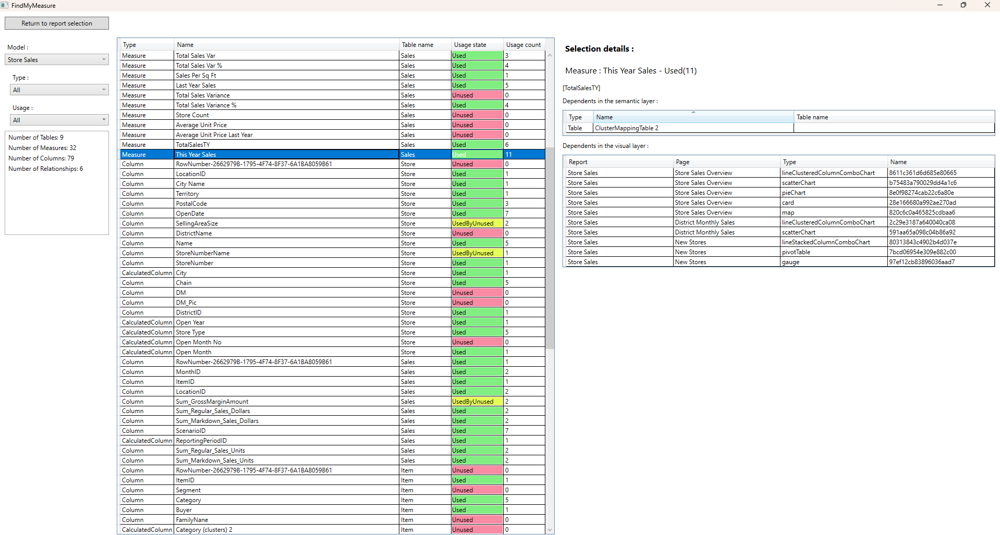
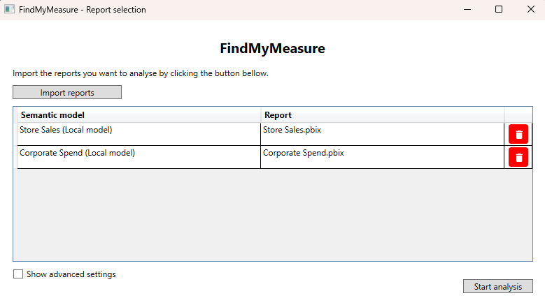

# FindMyMeasure




This is a small project I created to mimic some features from MeasureKiller. 

To be more specific this software allows dependency discovery for every measure and column in a semantic mode across multiple PowerBI reports. 

In my use case it allowed me connect to multiple Tabular models in Azure Analysis Services and find where each measure / column is Used. 

This project is split into 2 parts : 
- The UI project "FindMyMeasure.Gui" was created using WPF.
- The class library "FindMyMeasure" allows analysis of PowerBI reports in different projects. You can find some examples in the "Examples" folder. 


## Supported backends 
At the time of writing, I was only able to test 2 different ways to connect to a semantic model:
- Azure Analysis Services 
- Local models 

For other models all bets are off. It may or may not work.

I plan to change this in the future. \
In order to increase the support list, I will most try to use the DaxStudio cmd `dscmd.exe`, as a dependency. \
This will allow you to connect to all the semantic models they support.

## How to use ?

### The UI
When opening the opening the program, you will first need to choose which reports to analyse.



/!\ If the models use local semantic models, make sure to open the reports in PowerBI Desktop.

You can then hit the "Start Analysis" button. 
Once the analysis is done, you will be taken to the main window 


Here you can see all the measures and columns present in your semantic model. \
Just like in MeasureKiller, we calculate for each measure the amount of use in the semantic model, and in the reports linked. 

A measure or a column can have 1 of 3 states : 
- `Used` : A measure is considered used if :
 - It is used in the report in a visual or filter
 - It is used in a relationship in the semantic model
 - It is used in a calculated Table in the semantic model
 - It is used to calculate another measure or column that happens to be `Used` 
- `Unused` : The measure or column isn't used. 
- `UsedByUnused` : The measure or column is used to calculate measures or calculated columns, but they are all `Unused`

There are some report samples you can find in the ReportSamples folder. If you would like to know where those came from, you can read the README.

### The class library

The `FindMyMeasure` class library provides core functionality for analysing PowerBI semantic models and reports. It allows you to explore the dependents tree for the different measures. 

#### Key Classes

- **SemanticModel**: Represents a semantic model (Analysis Services, local, etc.) containing tables, columns, measures, and relationships.
- **PowerBIReport**: Represents a PowerBI report file (.pbix) with pages and visuals.
- **Filter**: Represents filters at report, page, or visual level that reference measures and columns.
- **Visual**: Represents a visual (chart, table, etc.) in a report page.
- **Column / Measure**: Represent data model elements with dependency tracking.

#### Usage Example

```csharp
// Analyze a semantic model and discover dependencies
var semanticModel = new SemanticModel(connectionString);
semanticModel.LoadFullModel()
var report = PowerBIReport.LoadFromPbix(reportPath, semanticModel, true, true);

// The analysis will automatically track:
// - Which measures/columns are used in visuals
// - Which measures/columns are used in filters
// - Which measures/columns depend on other measures/columns

// Query usage information
var usedMeasures = semanticModel.GetMeasures().Where(m => m.GetUsageState() == UsageState.Used);
var unusedColumns = semanticModel.GetColumns().Where(c => c.GetUsageState() == UsageState.Used);
```

## How to build ?
### Prerequisites
- Visual Studio. I developed the software with version 17.14.36414.22, but there is no reason it shouldn't work with older version
- .NET Framework v4.7.2

Plus, if you're trying to analyse models included in the reports, you'll need to have them opened in PowerBI. 

### Building
1. Open the solution file `FindMyMeasure.sln` in Visual Studio
2. Set the starting project as "FindMyMeasure.Gui"
3. Build the project

I you want to execute the examples, you can change the starting project.


## Known bugs
The bug : When connecting to Azure Analysis Services, I get an authentification error. \
The explanation : Currently, I use a very naive approach to auth. I just hope your machine is enrolled into Azure AD, and I'm relying on Windows Integrated Auth. I do not trigger MSAL fr now. 

---

Currently Windows gives a security warning about the program because it is not signed. I do not currently have the means to get paid signature, or the requirements to get a free signature, so this is not on the roadmap yet. 


## Contributing
- Contributions are welcome. Please:
  - Open issues to discuss features or bugs.
  - Submit pull requests with concise descriptions and tests when appropriate.
  - Follow existing code style

## Roadmap / TODO
- Change metadata gathering by using the `DaxStudio cmd`. This does add a dependecy to the project but will make the authenticating process easier and safer. 
- Finish french translations.
- Maybe rework the UI to use the MVVM pattern.

## License
This project is provided under the MIT License. See LICENSE file for details.

## AI use disclosure
I use the LLMs available in Visual Studio to help with some parts of the software. \
I used it more specificaly to code the GUI with WPF, and I used it to comment my code in the class library. \
I did not just vibe code the whole thing


